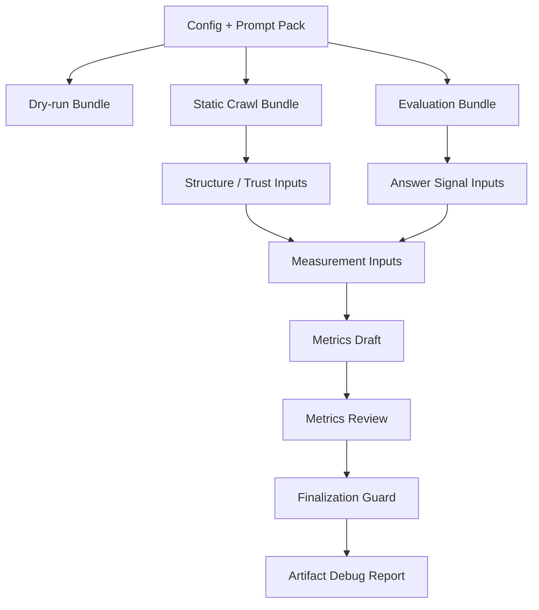

# OpenVisi Architecture

OpenVisi is an artifact-first TypeScript monorepo for AI Visibility diagnostics.

## Package and App Boundaries

```text
packages/core
  Shared contracts, artifact schemas, validators, prompt packs, metrics draft/review/finalization logic.

packages/crawler
  Static crawler utilities and CrawledPageSnapshot normalization.

packages/evaluator
  Provider-agnostic evaluator contracts and deterministic mock provider.

apps/cli
  Filesystem orchestration, command parsing, artifact bundle writing, artifact inspection, and local demo flows.
```

Dependency direction:

- `packages/core` should not depend on `apps/cli`.
- `apps/cli` may depend on `packages/core`, `packages/crawler`, and `packages/evaluator`.
- Downstream packages should consume shared contracts from `packages/core`, not CLI internals.

## Artifact Pipeline



## Stages

- `dry-run`: validates config and materializes prompt planning artifacts.
- `static-crawl`: writes canonical crawl artifacts and structure/trust inputs.
- `evaluation`: writes deterministic mock answer artifacts and answer signal inputs.
- `measurement-inputs`: composes crawler-derived and evaluator-derived input artifacts.
- `metrics-draft`: derives transparent draft metric values.
- `metrics-review`: reviews draft metrics and blocks final scoring under mock evidence.
- `metrics-finalization`: decides whether a future stage may generate final metrics.
- `debug-report`: writes a human-readable pipeline debug report.

## Why Staged Artifacts

OpenVisi stages artifacts so every downstream output has explicit provenance. This makes it clear which evidence is crawler-derived, evaluator-derived, draft, reviewed, or blocked.

The staging model prevents mock evaluator output from being treated as production evidence.

## Mock Evidence and Final Scoring

The mock evaluator exists for deterministic local verification. It is not real LLM evidence.

Under mock evidence:

- `metrics-review.json` blocks finalization.
- `metrics-finalization.json` blocks `metrics.json`.
- final `aiVisibilityScore` is not computed.
- `scan-result.json` is not written.

Future real-provider work must preserve these evidence gates.
