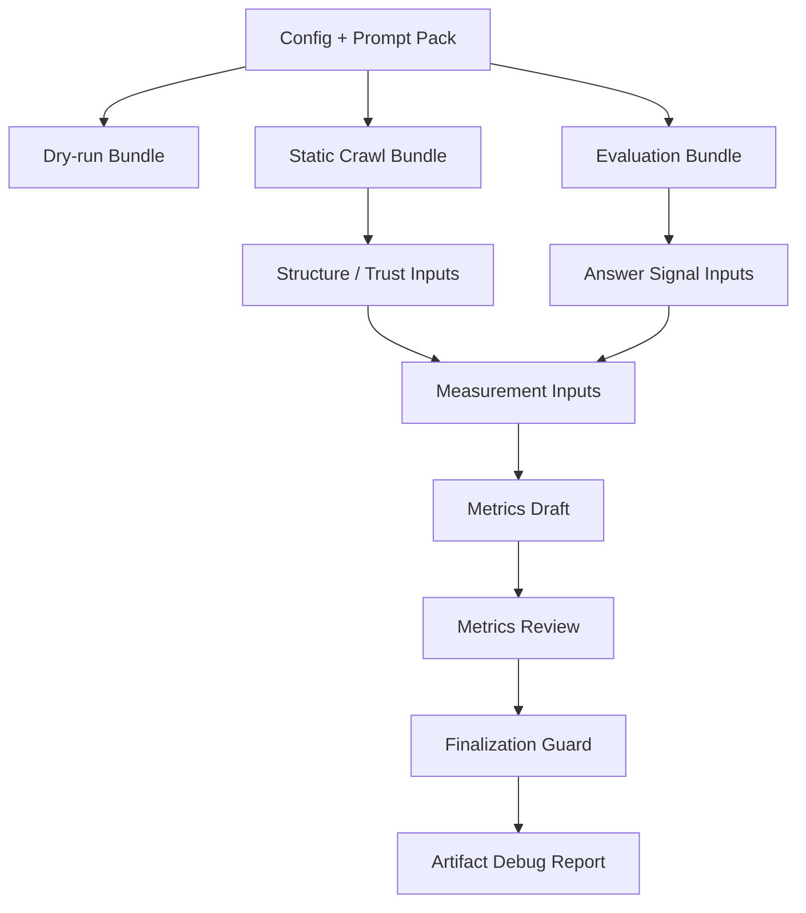

# OpenVisi

OpenVisi defines an open-source measurement layer for AI Visibility.

AI Visibility is the measurable presence, accuracy, citation quality, and competitive position of an entity across AI-generated answers.

OpenVisi is developer infrastructure for AI Visibility Diagnostics: typed schemas, reproducible artifact bundles, static crawl evidence, deterministic mock evaluation, review gates, and human-readable debug reports. It is not an AI SEO tool, a ranking optimizer, or a hosted dashboard.

## Why AI Visibility Needs a Measurement Layer

LLM-powered answers combine entity mentions, source interpretation, citations, and competitor recommendations into a surface that is harder to inspect than traditional search results. Teams need a repeatable way to ask:

- Was the target entity present in AI-generated answers?
- Was the entity described with enough clarity?
- Which source and citation signals were available?
- Did answers route users toward competitors?
- Which evidence is crawler-derived, evaluator-derived, draft, reviewed, or blocked?

OpenVisi keeps these questions explicit by producing artifact bundles instead of hiding the pipeline behind a single opaque score.

## Current Status

OpenVisi currently provides a local, mock-only demo pipeline:

- static crawler artifacts for AI-readable Structure and Machine-readable Trust evidence
- deterministic mock evaluator artifacts for answer signal plumbing
- composed measurement input artifacts
- explainable metrics draft artifacts
- review and finalization gates that block final scoring under mock evidence
- `debug-report.md` for human-readable pipeline inspection

Current limits are intentional:

- Mock evaluator evidence is not real LLM evidence.
- Final metrics generation is blocked by design.
- No final AI Visibility Score is computed.
- `metrics.json`, `scan-result.json`, final `report.md`, and final `report.html` are not generated by this pipeline.

## Current RC Surfaces

- CLI artifact pipeline: current RC truth.
- Web demo: schema-backed directional sample.
- Legacy scan: compatibility diagnostic only.
- Demo AI Visibility Score values are previews, not provider-verified final scores.

See [Project Brief](PROJECT_BRIEF.md) and [Current Status](CURRENT_STATUS.md) for the repo-level scope guardrails.

## Quick Start

Install and build locally:

```bash
npm install
npm run build
```

## Run the Local Mock Demo

The fastest way to validate the OSS demo pipeline is:

```bash
npm run demo:mock
```

This starts a local fixture HTTP server, runs the full mock artifact pipeline, validates every bundle, and writes:

```text
.openvisi-demo/openvisi-debug-report/debug-report.md
```

The demo uses deterministic mock evaluator evidence. It does not use external network access, does not require API keys, does not generate `metrics.json`, and does not compute a final AI Visibility Score.

Create a starter config:

```bash
npx openvisi init
```

Run the full demo artifact pipeline:

```bash
npx openvisi scan --dry-run --provider mock --output openvisi-report

npx openvisi crawl --config openvisi.config.json --output openvisi-crawl --render-mode static

npx openvisi eval --provider mock --output openvisi-eval

npx openvisi inputs compose --crawl-output openvisi-crawl --eval-output openvisi-eval --output openvisi-measurement

npx openvisi metrics draft --measurement-output openvisi-measurement --output openvisi-metrics-draft

npx openvisi metrics review --metrics-draft-output openvisi-metrics-draft --output openvisi-metrics-review

npx openvisi metrics guard --metrics-review-output openvisi-metrics-review --output openvisi-metrics-finalization

npx openvisi debug report \
  --dry-run-output openvisi-report \
  --crawl-output openvisi-crawl \
  --eval-output openvisi-eval \
  --measurement-output openvisi-measurement \
  --metrics-draft-output openvisi-metrics-draft \
  --metrics-review-output openvisi-metrics-review \
  --metrics-finalization-output openvisi-metrics-finalization \
  --output openvisi-debug-report
```

Inspect any bundle:

```bash
npx openvisi artifacts inspect --output openvisi-debug-report --stage debug-report
```

Open the debug report:

```bash
open openvisi-debug-report/debug-report.md
```

## Artifact Pipeline



## Example Output Bundles

```text
openvisi-report/
  scan-plan.json
  prompt-pack.json
  config.normalized.json
  artifact-manifest.json
  warnings.json

openvisi-crawl/
  crawled-pages.json
  crawler-summary.json
  structure-trust-inputs.json
  report-references.json
  artifact-manifest.json
  warnings.json

openvisi-eval/
  config.normalized.json
  prompt-pack.json
  answers.json
  answer-signal-inputs.json
  artifact-manifest.json
  warnings.json

openvisi-measurement/
  measurement-inputs.json
  artifact-manifest.json
  warnings.json

openvisi-metrics-draft/
  metrics-draft.json
  artifact-manifest.json
  warnings.json

openvisi-metrics-review/
  metrics-review.json
  artifact-manifest.json
  warnings.json

openvisi-metrics-finalization/
  metrics-finalization.json
  artifact-manifest.json
  warnings.json

openvisi-debug-report/
  debug-report.md
  artifact-manifest.json
  warnings.json
```

Runtime output directories are ignored by git. Curated examples live under [`examples/`](examples/).

## How to Read `debug-report.md`

`debug-report.md` is an artifact debug report. It explains which pipeline stages ran, which artifact bundles validated, what evidence was available, which draft metrics were reviewable, and why final metrics remain blocked.

It is not a final AI Visibility report. It does not compute a final AI Visibility Score. It is intended for OSS demo clarity, contributor onboarding, and local pipeline debugging.

## Documentation

- [Quickstart](docs/quickstart.md)
- [Demo Pipeline](docs/demo-pipeline.md)
- [Local Mock Demo Verification](docs/demo-verification.md)
- [Artifact Debug Report](docs/debug-report.md)
- [Artifacts](docs/artifacts.md)
- [Metrics Draft](docs/metrics-draft.md)
- [Metrics Review](docs/metrics-review.md)
- [Metrics Finalization](docs/metrics-finalization.md)
- [CLI Reference](docs/cli.md)
- [Artifact Compatibility](docs/artifact-compatibility.md)
- [Architecture](ARCHITECTURE.md)
- [Roadmap](ROADMAP.md)
- [Security](SECURITY.md)

## Repository Layout

```text
apps/
  cli/        OpenVisi CLI commands
  web/        Minimal web scaffold for future experiments
packages/
  core/       Shared contracts, schemas, validators, metrics draft/review guards
  crawler/    Static crawler and canonical snapshot adapters
  evaluator/  Provider-agnostic evaluator contracts and deterministic mock provider
  report/     Existing report generation package
  providers/  Provider adapter placeholders
  analyzer/   Public analyzer package facade
examples/     Curated examples for OSS visitors
docs/         Methodology, CLI, artifact, and demo docs
```

## Development

```bash
npm run typecheck
npm test
npm run lint
npm run build
```

CI follows the same npm-first validation path.

## Release Candidate Status

OpenVisi v0.1.0 is a release candidate for the artifact-based mock pipeline. It is focused on shared contracts, deterministic local verification, staged artifacts, and review gates.

This release candidate is still mock-only. Real provider adapters, final `metrics.json`, final AI Visibility Score computation, production scoring, and final reports are future work.

Release resources:

- [Changelog](CHANGELOG.md)
- [Release Checklist](docs/release-checklist.md)
- [Release Rehearsal](docs/release-rehearsal.md)
- [Versioning](docs/versioning.md)
- [v0.1.0 Release Notes](docs/release-notes/v0.1.0.md)
- [v0.1.0 RC Freeze Review](docs/release-notes/v0.1.0-rc-freeze-review.md)

## Contributing

Contributions are welcome around vocabulary, methodology documentation, artifact contracts, crawler reliability, evaluator boundaries, fixtures, and developer experience.

Please keep changes small, observable, and grounded in explicit evidence. Avoid adding final scoring, real provider calls, dashboards, or SaaS flows unless a future stage explicitly opens that scope.

OSS project resources:

- [Contributing Guide](CONTRIBUTING.md)
- [Roadmap](ROADMAP.md)
- [Architecture](ARCHITECTURE.md)
- [Security Policy](SECURITY.md)
- [Code of Conduct](CODE_OF_CONDUCT.md)

## License

MIT. See [LICENSE](LICENSE).
