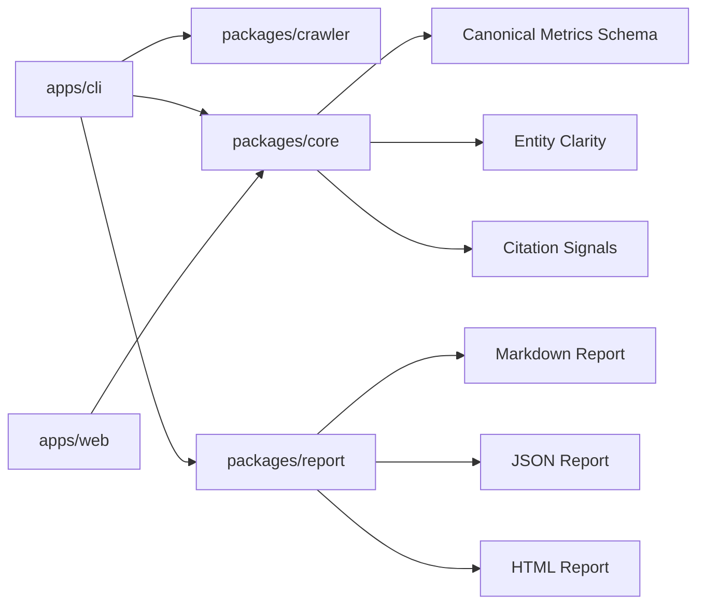

# OpenVisi

OpenVisi defines an open-source measurement layer for AI Visibility.

AI Visibility is the measurable presence, accuracy, citation quality, and
competitive position of an entity across AI-generated answers.

OpenVisi provides canonical vocabulary, transparent methodology, schemas, and
diagnostic reporting foundations for measuring how brands, products, websites,
and entities appear across LLM-powered search and answer surfaces.

OpenVisi is developer infrastructure. It is not an AI SEO plugin, a ranking
optimizer, a content farm workflow, or a wrapper around LLM APIs.

## Why AI Visibility Matters

Search is shifting from links to synthesized answers. Teams need to understand
whether AI-generated answers mention the right entity, describe it accurately,
cite reliable sources, and route users toward or away from competitors.

OpenVisi focuses on measurable, explainable, and reproducible diagnostics:

- shared vocabulary for AI Visibility reports
- transparent metrics and schema fields
- repeatable prompt pack methodology
- machine-readable website and source diagnostics
- benchmark language that avoids unsupported ranking claims

## The OpenVisi AI Visibility Model

OpenVisi organizes AI Visibility into four layers:

- Presence Layer: Does AI mention the entity?
- Accuracy Layer: Does AI describe the entity correctly?
- Citation Layer: Which sources does AI use to understand the entity?
- Competitive Layer: Does AI route the user toward competitors?

See [The OpenVisi AI Visibility Model](docs/methodology/measurement-model.md).

## Canonical Metrics

Core schema fields include:

- `aiVisibilityScore`
- `answerPresence`
- `answerShare`
- `entityClarity`
- `citationCoverage`
- `competitorDisplacement`
- `machineReadableTrust`
- `aiCitationSignals`

Example canonical CLI JSON output:

```json
{
  "aiVisibilityScore": 72,
  "answerPresence": 0.64,
  "answerShare": 0.41,
  "entityClarity": 0.71,
  "citationCoverage": 0.38,
  "competitorDisplacement": 0.42,
  "machineReadableTrust": 0.56,
  "aiCitationSignals": 0.49
}
```

The current MVP uses crawl-based diagnostics and does not yet run live
provider-backed AI answer scans by default. Scores should be interpreted as
directional methodology outputs, not as predictions for proprietary AI products.

## Documentation

- [OpenVisi Glossary](docs/glossary.md)
- [Measurement Model](docs/methodology/measurement-model.md)
- [Metrics](docs/methodology/metrics.md)
- [Scoring](docs/methodology/scoring.md)
- [Prompt Packs](docs/methodology/prompt-packs.md)
- [Limitations](docs/methodology/limitations.md)
- [Demo Report Template](examples/demo-report.md)

## Latest Scan Note

- [Popular Does Not Mean AI-readable](docs/articles/popular-websites-ai-readable.html)
  explains what OpenVisi found when scanning Google, YouTube, Facebook,
  Instagram, ChatGPT, and Wikipedia with the crawl-diagnostic v0.1 measurement
  layer.

## Current MVP Features

- CLI scanner for public websites
- Markdown, JSON, and HTML report generation
- Machine-readable visibility diagnostics
- Entity clarity and source-structure analysis
- Analyzer maturity labels for transparent methodology status
- Fixture-based directional tests
- npm-first development and CI workflow

## Public Demo

The first static GitHub Pages demo is available at:

- [OpenVisi Public Demo](https://simonsaysss-blip.github.io/openvisi/demo/)

The demo is a static snapshot built from the current HTML reporting system. It
shows report format, visual language, and CLI workflow; it is not a live hosted
scanner.

## Quick Start

```bash
npm install
npm run build
node ./apps/cli/dist/index.js scan https://example.com
```

The CLI writes reports to a site-specific folder under `reports/`.

```text
reports/example-com/report.md
reports/example-com/report.json
reports/example-com/report.html
```

`reports/` is runtime output and is intentionally ignored by git. Curated demo
artifacts live under [examples/reports](examples/reports/).

## Architecture



Repository layout:

```text
apps/
  cli/        Command-line scanner
  web/        Minimal web scaffold for future report viewing experiments
packages/
  core/       Shared types, scoring, and canonical metrics schema
  crawler/    Website crawler and HTML extractor
  report/     Markdown, JSON, and HTML report generation
  providers/  Provider adapter interface placeholders
  analyzer/   Public analyzer package facade
docs/
  concepts/     Canonical concept docs
  methodology/  Measurement model, metrics, scoring, prompt packs, limitations
  glossary.md   Canonical vocabulary for AI Visibility
benchmarks/
  exploratory/  Methodology-oriented benchmark scaffolds without collected data
fixtures/
  */            Synthetic examples for directional analyzer validation
examples/
  demo-report.md  Canonical demo report template
  reports/        Curated generated reports
```

## Project Status

OpenVisi is a working OSS MVP with a methodology-first roadmap.

Current status:

- CLI scan flow works locally after `npm run build`
- Markdown, JSON, and HTML reports are generated
- analyzer output includes evidence-oriented fields
- methodology version is exposed in reports
- canonical metrics schema has been added to `@openvisi/core`
- fixture-based directional tests are in place

Known limitations:

- OpenVisi does not call commercial LLM provider APIs in the MVP.
- Prompt simulation is currently scaffolded and diagnostic.
- Scores are heuristic snapshots, not live ranking predictions.
- The crawler is lightweight and may not fully represent JavaScript-heavy sites.
- The package is not claimed as published; use repository scripts for local
  development.

## Development

```bash
npm install
npm run typecheck
npm test
npm run lint
npm run build
```

CI runs the same npm-first validation path with `npm ci`.

## GitHub Pages

The public demo lives under [docs/demo/index.html](docs/demo/index.html).

GitHub Pages can be deployed from the repository's `/docs` directory. This
repository also includes a GitHub Pages workflow that publishes the `docs/`
folder as a static artifact:

1. Enable GitHub Pages for the repository.
2. Set the Pages source to GitHub Actions.
3. Push to `main`.
4. Confirm the `GitHub Pages` workflow completes successfully.

No framework build step is required for the demo page.

## Contributing

Contributions are welcome around vocabulary, methodology documentation,
fixtures, report explainability, crawler reliability, and developer experience.

Please keep changes small, observable, and grounded in public evidence.

See [CONTRIBUTING.md](CONTRIBUTING.md).

## License

MIT. See [LICENSE](LICENSE).
