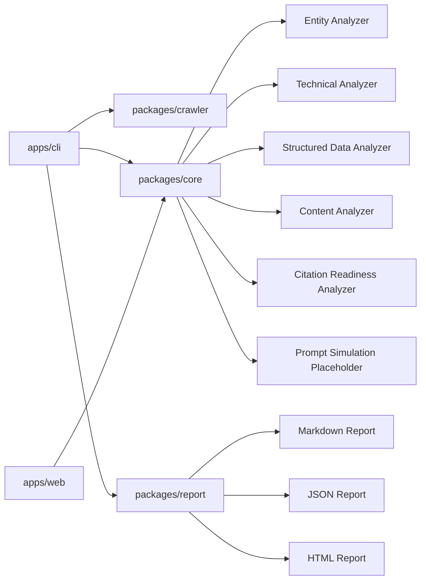

# OpenVisi

OpenVisi is an open-source AI visibility analysis toolkit that helps teams understand how readable, citeable, and machine-readable their websites are for AI search and LLM-powered discovery.

**Open-source AI-readable visibility diagnostics for the LLM search era.**

OpenVisi is not a search keyword tracker, content farm, agency automation tool, or ranking tool. It is an early-stage developer toolkit for inspecting public machine-readable visibility signals that may help LLM-powered discovery systems understand a website.

## What OpenVisi Does Today

The current MVP provides a CLI that:

- crawls a target website with basic robots-aware discovery
- checks technical, structured data, content, entity, and citation-readiness signals
- computes a directional AI Visibility Score
- writes Markdown, JSON, and HTML reports
- surfaces diagnostic issues, evidence, and suggested structural improvements

The scoring model is heuristic and diagnostic. It does not claim to predict rankings, citations, recommendations, or answer inclusion inside ChatGPT, Claude, Gemini, Perplexity, or any other specific AI product.

## Who It Is For

- Open-source maintainers improving project websites and documentation
- Developers building AI search, content intelligence, or documentation workflows
- product and documentation teams preparing public websites for LLM-powered discovery
- Education teams that need clearer entity, service, and trust signals
- Small teams that want transparent diagnostics instead of black-box visibility claims

## Analyzer Categories

OpenVisi currently reports these categories:

- **Entity Clarity**: brand name, business type, service description, location, target audience, contact information, and Organization or LocalBusiness schema signals
- **Technical Discoverability**: `robots.txt`, `sitemap.xml`, `llms.txt`, canonical URLs, meta descriptions, Open Graph metadata, JSON-LD coverage, and crawl status
- **Structured Data**: schema.org type coverage and page-level JSON-LD usage
- **Content Chunkability**: H1/H2 structure, FAQ presence, definition-style paragraphs, readable text, and text-to-visual ratio warnings
- **Citation Readiness**: author or freshness signals, external references, factual claims, evidence pages, and trust signals
- **Prompt Simulation**: currently scaffolded as a non-API placeholder; provider-backed interpretation checks are not part of the MVP

See [docs/methodology.md](docs/methodology.md) for the current methodology and limitations.

## Quickstart

```bash
npm install
npm run build
npm run cli -- scan https://example.com
```

The scan writes runtime output to:

```text
reports/example-com/report.md
reports/example-com/report.json
reports/example-com/report.html
```

`reports/` is runtime output and is intentionally ignored by git.

## Demo Report

A curated exploratory benchmark snapshot is committed under:

- [examples/reports/example-com/report.md](examples/reports/example-com/report.md)
- [examples/reports/example-com/report.json](examples/reports/example-com/report.json)
- [examples/reports/example-com/report.html](examples/reports/example-com/report.html)

This demo is generated from the verified smoke-test command:

```bash
npm run cli -- scan https://example.com
```

## Example CLI Output

```text
AI Visibility Score: 34/100
Entity Clarity Score: 45/100
Technical Discoverability Score: 12/100
Structured Data Score: 10/100
Content Chunkability Score: 54/100
Citation Readiness Score: 48/100

Top 10 Diagnostic Signals:
1. [high] Organization-level schema is missing
2. [high] sitemap.xml was not found
3. [high] No key schema.org types were detected

Top 10 Suggested Improvements:
1. [high] Add Organization or LocalBusiness JSON-LD with name, URL, logo, sameAs, and contact.
2. [high] Publish an XML sitemap with canonical URLs for important pages.
3. [high] Add relevant JSON-LD such as Organization, Service, Product, FAQPage, or Article.

Report output path: /path/to/openvisi/reports/example-com/report.md
```

## Architecture



## Repository Layout

```text
apps/
  cli/        Command-line scanner
  web/        Minimal web scaffold reserved for later report viewing experiments
packages/
  core/       Shared types, scoring, and current analyzer implementation
  crawler/    Website crawler and HTML extractor
  report/     Markdown, JSON, and HTML report generation
  providers/  Provider adapter interface placeholders
  analyzer/   Public analyzer package facade
docs/
  architecture.md
  methodology.md
  roadmap.md
  future-applications.md
benchmarks/
  exploratory/  Methodology-oriented benchmark scaffolds without collected data
fixtures/
  */            Synthetic examples for future analyzer validation
examples/
  reports/    Curated demo reports
```

## Development Commands

```bash
npm install
npm run build
npm run typecheck
npm test
npm run lint
npm run cli -- scan https://example.com
```

CI uses the same npm-first workflow with `npm ci`.

## Current Limitations

- OpenVisi does not call ChatGPT, Claude, Gemini, Perplexity, or other LLM providers in the MVP.
- The AI Visibility Score is an early diagnostic signal, not a definitive ranking model.
- The crawler is intentionally lightweight and may not fully represent JavaScript-heavy sites.
- Prompt simulation is currently represented as a placeholder score because provider-backed interpretation checks are not implemented.
- The package is not claimed as published; use the repository scripts for local development.

## Future Methodology Directions

OpenVisi's methodology work is expected to focus on repeatable benchmark datasets, explainable scoring notes, comparative snapshots, fixture validation, and rule-level methodology hardening. These are research and diagnostics foundations, not claims of real-time AI ranking tracking or citation guarantees.

## Roadmap

See [docs/roadmap.md](docs/roadmap.md).

## Contributing

Contributions are welcome, especially around repeatable fixtures, clearer scoring evidence, documentation, and report quality.

Start with:

```bash
npm install
npm run typecheck
npm test
npm run lint
```

Please keep changes small, explainable, and grounded in observable website signals.

## License

MIT. See [LICENSE](LICENSE).
