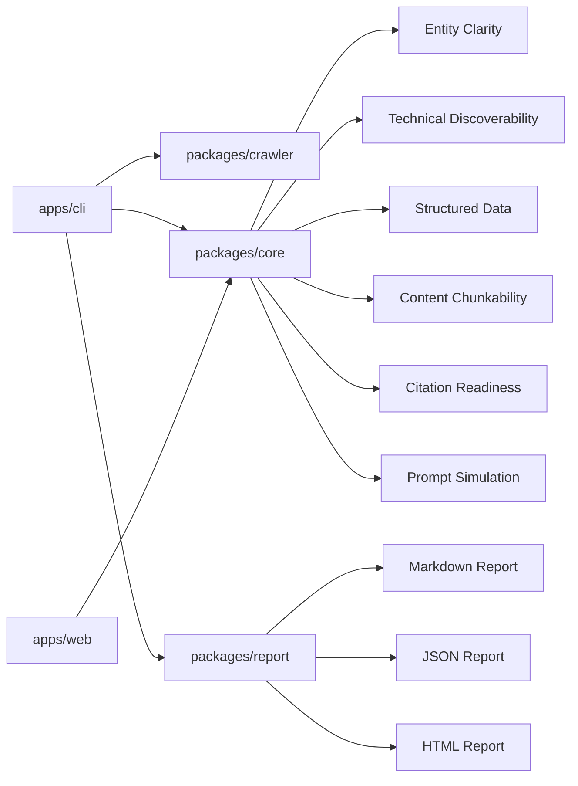

# OpenVisi

OpenVisi is an open-source AI visibility analytics toolkit for the LLM search era.

It helps developers, documentation teams, maintainers, and website owners inspect whether a public website exposes clear, machine-readable signals that AI search engines and LLM-powered discovery systems can understand, cite, and reason about.

OpenVisi is developer infrastructure. It is not an SEO agency tool, a ranking optimizer, a content farm workflow, or a wrapper around LLM APIs.

## What is OpenVisi

OpenVisi is a CLI-first diagnostics toolkit that scans a website and generates explainable reports about AI-readable visibility signals.

The current MVP evaluates signals such as:

- entity clarity
- technical discoverability
- structured data coverage
- content chunkability
- citation readiness
- prompt simulation scaffolding

The scoring model is heuristic and directional. OpenVisi does not claim to predict rankings, citations, recommendations, or answer inclusion inside ChatGPT, Claude, Gemini, Perplexity, or any other specific AI product.

## Why AI Visibility Matters

LLM-powered discovery is becoming another layer through which people find products, documentation, schools, services, open-source projects, and research.

For a website to be understood by these systems, it helps to expose clear public signals:

- what the entity is
- what it offers
- who it serves
- where it operates
- whether its pages are crawlable
- whether structured data is present
- whether claims, trust signals, and references are clear

OpenVisi focuses on measuring those public, machine-readable structures. It treats scores as diagnostic signals, not as definitive ranking models.

## Features

- CLI scanner for public websites
- Markdown, JSON, and HTML report generation
- AI Visibility Score with category-level scores
- Explainable diagnostic signals and suggested structural improvements
- Analyzer maturity labels for transparent methodology status
- Methodology versioning in generated reports
- Fixture-based directional tests for repeatable validation
- npm-first development and CI workflow

## Public Demo

The first static GitHub Pages demo is available at:

- [OpenVisi Public Demo](https://simonsaysss-blip.github.io/openvisi/demo/)

The demo is a static snapshot built from the current HTML reporting system. It is intended to show the report format, visual language, and CLI workflow; it is not a live hosted scanner.

## Quick Start

```bash
npm install
npm run build
node ./apps/cli/dist/index.js scan https://mavisenglish.com
```

The CLI writes reports to a site-specific folder under `reports/`.

For example:

```text
reports/mavisenglish-com/report.md
reports/mavisenglish-com/report.json
reports/mavisenglish-com/report.html
```

`reports/` is runtime output and is intentionally ignored by git.

## Example CLI Output

```text
AI Visibility Score: 54/100
Entity Clarity Score: 77/100
Technical Discoverability Score: 66/100
Structured Data Score: 10/100
Content Chunkability Score: 55/100
Citation Readiness Score: 62/100

Top Diagnostic Signals:
1. [high] Organization-level schema is missing
2. [high] No key schema.org types were detected
3. [high] Entity schema is missing
4. [medium] Business type is not explicit
5. [medium] JSON-LD coverage is low
6. [medium] FAQPage schema was not detected
7. [medium] Some pages appear text-poor
8. [medium] Author, reviewer, or last-updated signals are weak
9. [low] Location or service area is unclear
10. [low] llms.txt was not found

Report output path:
reports/mavisenglish-com/report.md
```

## Report Output

Each scan generates three report formats:

- `report.md`: human-readable diagnostic report
- `report.json`: structured analyzer output for tooling and comparison
- `report.html`: standalone visual report

Reports include:

- methodology version
- analyzer maturity labels
- category scores
- detected signals
- missing signals
- diagnostic interpretation
- suggested structural improvements

Curated demo reports are kept under:

- [examples/reports/example-com/report.md](examples/reports/example-com/report.md)
- [examples/reports/example-com/report.json](examples/reports/example-com/report.json)
- [examples/reports/example-com/report.html](examples/reports/example-com/report.html)

## Architecture



Repository layout:

```text
apps/
  cli/        Command-line scanner
  web/        Minimal web scaffold for future report viewing experiments
packages/
  core/       Shared types, scoring, and current analyzer implementation
  crawler/    Website crawler and HTML extractor
  report/     Markdown, JSON, and HTML report generation
  providers/  Provider adapter interface placeholders
  analyzer/   Public analyzer package facade
docs/
  architecture.md
  methodology.md
  roadmap.md
  future-applications.md
benchmarks/
  exploratory/  Methodology-oriented benchmark scaffolds without collected data
fixtures/
  */            Synthetic examples for directional analyzer validation
examples/
  reports/      Curated demo reports
```

## Roadmap

OpenVisi is intentionally early and methodology-first.

Near-term work focuses on:

- improving report explainability
- expanding repeatable fixture coverage
- hardening the scoring methodology
- documenting analyzer limitations
- improving CLI ergonomics
- adding more curated benchmark snapshots without overstating conclusions

See [docs/roadmap.md](docs/roadmap.md) and [docs/methodology.md](docs/methodology.md).

## Project Status

OpenVisi is a working OSS MVP.

Current status:

- CLI scan flow works locally after `npm run build`
- Markdown, JSON, and HTML reports are generated
- analyzer output includes evidence-oriented fields
- methodology version is exposed in reports
- fixture-based directional tests are in place
- GitHub Actions uses an npm-first CI workflow

Known limitations:

- OpenVisi does not call commercial LLM provider APIs in the MVP.
- Prompt simulation is currently scaffolded and diagnostic.
- Scores are heuristic snapshots, not live ranking predictions.
- The crawler is lightweight and may not fully represent JavaScript-heavy sites.
- The package is not claimed as published; use the repository scripts for local development.

## Development

```bash
npm install
npm run typecheck
npm test
npm run lint
npm run build
```

CI runs the same npm-first validation path with `npm ci`.

## GitHub Pages

The public demo lives under [docs/demo/index.html](docs/demo/index.html).

GitHub Pages can be deployed from the repository's `/docs` directory. This repository also includes a GitHub Pages workflow that publishes the `docs/` folder as a static artifact:

1. Enable GitHub Pages for the repository.
2. Set the Pages source to GitHub Actions.
3. Push to `main`.
4. Confirm the `GitHub Pages` workflow completes successfully.

No framework build step is required for the demo page.

## Contributing

Contributions are welcome around fixtures, methodology documentation, report explainability, crawler reliability, and developer experience.

Please keep changes small, observable, and grounded in public website signals.

See [CONTRIBUTING.md](CONTRIBUTING.md).

## License

MIT. See [LICENSE](LICENSE).
