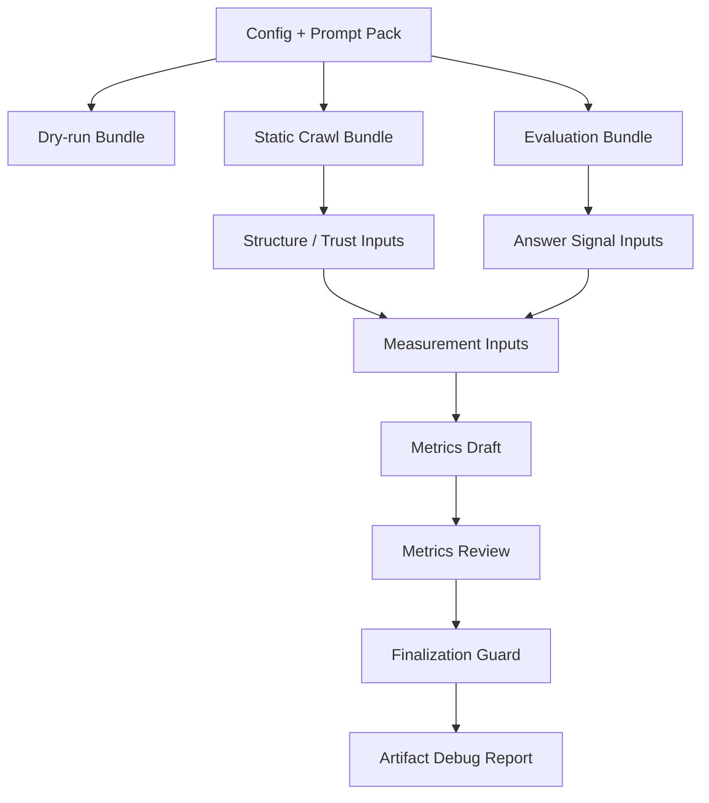

# OpenVisi Demo Pipeline

The current OpenVisi demo pipeline shows how artifact contracts connect crawler evidence, mock evaluator evidence, draft metrics, review gates, and a human-readable debug report.

It does not produce final metrics. It does not compute a final AI Visibility Score.

To run the full pipeline against a deterministic local fixture site:

```bash
npm run demo:mock
```

See [Local Mock Demo Verification](demo-verification.md).

## Pipeline Diagram



## Stages

### dry-run

Creates a normalized config, prompt pack, scan plan, manifest, and warnings.

This stage does not crawl and does not call evaluator providers.

### static-crawl

Runs the static crawler and writes canonical crawl artifacts.

Key artifacts:

- `crawled-pages.json`
- `crawler-summary.json`
- `structure-trust-inputs.json`

This stage provides AI-readable Structure and Machine-readable Trust evidence.

### evaluation

Runs the deterministic mock provider and writes evaluator artifacts.

Key artifacts:

- `answers.json`
- `answer-signal-inputs.json`

Mock answers are not real LLM evidence.

### measurement-inputs

Combines crawler-derived `structure-trust-inputs.json` and evaluator-derived `answer-signal-inputs.json`.

Key artifact:

- `measurement-inputs.json`

This is the final input bundle before draft metrics.

### metrics-draft

Creates transparent draft metrics from `measurement-inputs.json`.

Key artifact:

- `metrics-draft.json`

Draft metrics include formula explanations and source labels. They are not final scores.

### metrics-review

Reviews `metrics-draft.json` and blocks finalization under mock evidence.

Key artifact:

- `metrics-review.json`

### metrics-finalization

Decides whether a future stage is allowed to generate `metrics.json`.

Key artifact:

- `metrics-finalization.json`

Under mock evaluator evidence, finalization is blocked.

### debug-report

Creates a human-readable artifact pipeline summary.

Key artifact:

- `debug-report.md`

This is not a final AI Visibility report.

## Why No Final Score

The demo pipeline intentionally stops before final scoring because:

- evaluator evidence is deterministic mock output
- mock evidence is not real LLM evidence
- narrativeAccuracy requires real LLM evidence or human review
- metrics review blocks final readiness
- metrics finalization blocks `metrics.json` and final AI Visibility Score generation
